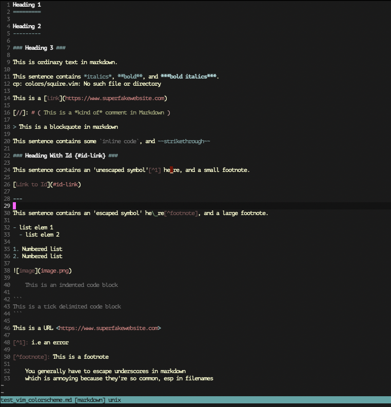
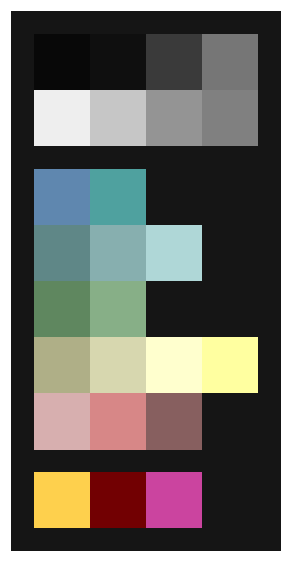

Squire
======

A dark, medium-contrast colorscheme for vim, inspired by my (other) favourite colorscheme: [`apprentice`](https://github.com/romainl/Apprentice), by Romain Lafourcade.

This colorscheme is a slightly higher contrast, for ease of viewing when there is more surrounding light, or some glare.

It also explicitly sets a few extra markdown options.

The colour palette is taken from the xterm colour palette to ensure consistency across 256 and higher colour environments.

Here is some Markdown in terminal MacVim:

Here's a few other examples in a multiwindow shot in terminal MacVim:

Here is a graphic with full colour palette:

- The background of the image is the background of the colorscheme (Grey11, xterm: 234, hex: #1c1c1c)
- The pink (MediumOrchid, xterm: 134, hex: #af5fd7) is the cursor colour, which is intentionally distinctive
- The yellow (LightGoldenrod2, xterm: 221, hex: #ffd75f) and red (DarkRed, xterm: 88, hex: #870000) at the bottom are the error and warning colours, also intentionally distinctive

