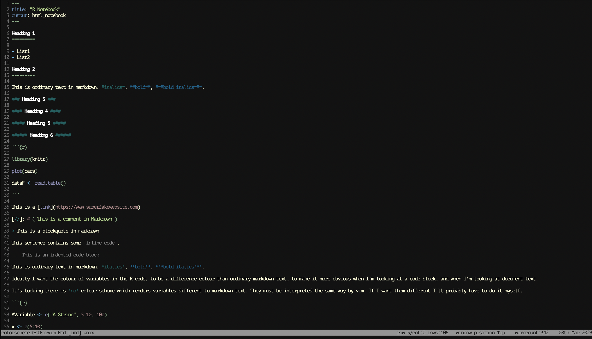

Squire
======

A dark, medium-contrast colorscheme for vim, inspired by one of the best colorschemes: Apprentice, by Romain Lafourcade.

The pallette is heavy on low contrast blues and greens, with some yellow and purple, and off-white text.

The goal was to end up with something similar to apprentice, with a slightly higher contrast against the background.

It also explicitly sets a few extra markdown options.

