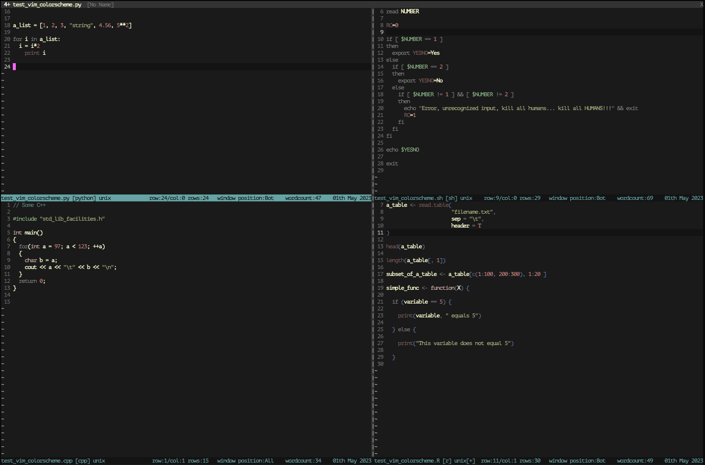

Squire
======

A dark, medium-contrast colorscheme for vim, inspired by my (other) favourite colorscheme: `apprentice`, by Romain Lafourcade.

The goal is to end up with something similar to apprentice, with a slightly higher contrast against the background.

It also explicitly sets a few extra markdown options.

Here's some markdown in terminal MacVim:

Here's a few other examples in a multiwindow shot in terminal MacVim:

